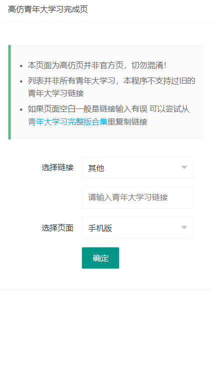
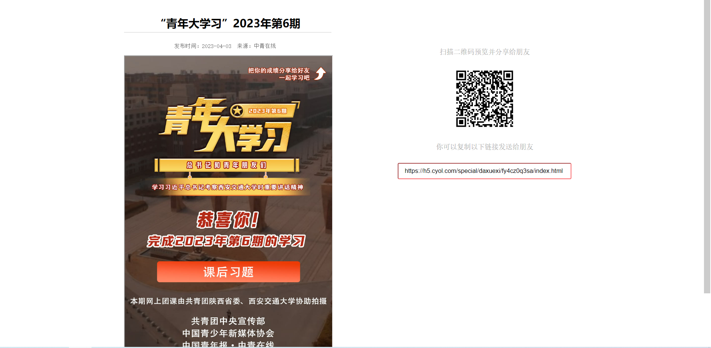

# 高仿青年大学习完成页

灵感来源于`青年一键学习`，本项目为高仿青年大学习的完成页面(可能存在瑕疵)

本项目使用了LayUi、[jQuery](https://jquery.com)

项目完全免费且开源，本项目不支持过旧的大学习链接。推荐PHP版本7.0(或更高)

# 使用方法

手机版（GET/POST）： qndxx.php?url=青年大学习链接

电脑版（GET/POST）： bg2.php?url=青年大学习链接

# 效果

## 首页

## 手机版

## 电脑版

